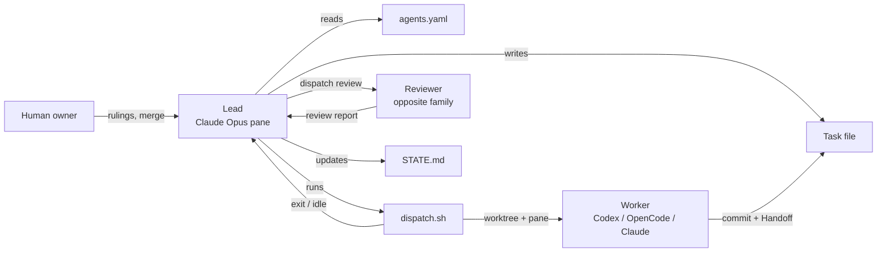
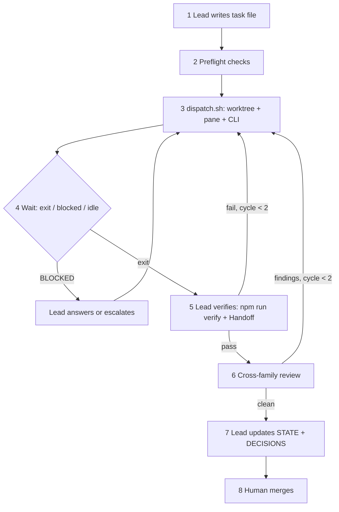

# Multi-Agent Dev Workflow — Agent Kit Playbook

Sep 25, 2026 · @Fajar

## Overview

The agent kit brings oh-my-opencode-slim's three ideas to a herdr-based setup: preset roles, category routing and automatic delegation. It works across Claude Code, Codex and OpenCode, with no OpenCode plugin lock-in. A Claude lead dispatches tasks to other agents on its own. The human approves contract changes and does every merge.

**Decisions already made**

- Fully automatic dispatch by the lead; it stops only at human gates.
- CLIs: Claude Code, Codex (OpenAI account A), OpenCode (OpenAI account B).
- Usual team: 1 lead + 1 builder + 1 designer. Never more than one builder at a time.
- Architect = Claude Opus 5.5. Designer = Codex gpt-6-astra. Builder = Claude Sonnet by default, with switchable model profiles.
- Every role loads the herdr skill by default. Caveman style is used for chat only, never for files other agents read.
- Workers commit on their own `agent/<task>` worktree branch. Only the human merges.
- Scope: the POS repo first; generalize to a reusable kit afterwards.

**Design principles**

1. **Config over prose.** Role, model and effort live in `agents.yaml`, not in chat instructions or MEMORY.md.
2. **Files are the memory; herdr is the switchboard.** Anything that must survive a closed pane is written to a file.
3. **Workers read their task file, not the whole project.** The lead puts everything a worker needs into the task file.
4. **Cross-family review.** Work built by an OpenAI model is reviewed by Claude, and the reverse.
5. **Gates are enforced by code, not only by prompts.** Contract files and merges are protected by hooks and branch rules.
6. **The cheapest runner that fits.** Subagent for questions, one-shot pane for scoped jobs, interactive pane for dialogue.

## Architecture

The kit has four parts. Together they replace what an OmO plugin does inside OpenCode.

| Part | Path | Replaces (OmO-slim) | Purpose |
| --- | --- | --- | --- |
| Presets | `.agent/agents.yaml` | `presets` in the plugin config | Role → CLI, model, effort, mode, owned paths; category → role routing; limits |
| Role prompts | `.agent/roles/<role>.md` | Built-in agent prompts | Short prompt (30–80 lines) injected when a role is launched |
| Dispatcher | `.claude/skills/dispatch/SKILL.md` + `.agent/bin/dispatch.sh` | Orchestrator delegation + background tasks | Lead-side skill that decides; script that opens worktree + herdr pane, launches CLI, waits, collects |
| Memory layout | `.agent/STATE.md`, `DECISIONS.md`, `LESSONS.md`, `journal/`, `tasks/` | Session state | Durable coordination the next agent can read cheaply |



The lead never edits source code. The one exception is trivial review fixes (see Review tiers). Otherwise it writes task files and memory, runs `dispatch.sh`, verifies the result and dispatches review. Herdr supplies the panes, the working/blocked/idle status and the agent-to-agent messaging. Check the exact herdr commands with `herdr --help` or with the herdr agent integration (`herdr integration install claude`).

## Roles, models and routing

The roster has seven roles on three runners. Expensive models do the judgment work; cheaper models handle scoped work and searching.

| Role | Default CLI / model | Mode | Runner | Owns (writes) | Verify |
| --- | --- | --- | --- | --- | --- |
| Lead / orchestrator | Claude Code · Opus 5.5 | Interactive | herdr pane (permanent) | `.agent/STATE.md`, `DECISIONS.md`, `tasks/*` (all but Handoff) | Runs the builder's verify |
| Architect / oracle | Claude Code · Opus 5.5 | Interactive | herdr pane (on demand) | Architecture doc, ADRs | Doc lint only |
| Designer | Codex · gpt-6-astra | Interactive | herdr pane (on demand) | `docs/design/*` (+ design tokens/CSS if assigned) | Docs only: none. Tokens/CSS/components: `npm run verify` + browser walk |
| Builder (fixer) | Claude Code · Sonnet (profiles below) | One-shot | herdr pane + own worktree, max 1 | Source, tests, its task's Handoff | `npm run verify` |
| Reviewer | Opposite family to whoever built it | One-shot | herdr pane | `.agent/reviews/<task>-review.md` | Re-runs verify |
| Explorer | Codex · gpt-6-luna one-shot (default); Claude Haiku subagent as fallback | One-shot / subagent | Inside the lead, or `ask.sh` | Nothing (returns a summary) | — |
| Librarian | Codex · gpt-6-luna one-shot (default); Claude Sonnet subagent as fallback | One-shot / subagent | Inside the lead, or `ask.sh` | Nothing (returns a summary) | — |

**Interactive vs one-shot.** Interactive is the normal chat screen (`claude`, `codex`, `opencode`). One-shot runs a single prompt and exits: `claude -p`, `codex exec`, `opencode run`. When the process exits, the job is done, so one-shot suits workers that start from a complete task file. A worker that hits a question writes `BLOCKED: <question>` in its Handoff and exits. The lead then resumes that same session with the answer.

**Subagent vs pane.** Use a subagent (`.claude/agents/*.md`) for a read-only question that should come back as a summary. Use a pane when the job is long, needs another vendor, or needs its own worktree. A pane restarts the CLI and reloads project files, which costs more than a 30-second search.

### Routing table

The lead sets `category` and `touches` in each task file's frontmatter. `dispatch.sh` maps them to roles.

| `category` | Built by | Reviewed by | Notes |
| --- | --- | --- | --- |
| `quick` (≤ 1–2 files, clear spec) | builder | Claude Sonnet if built on OpenAI; Codex gpt-6-luna if built by Sonnet | Lightest path |
| `feature` (multi-file, specified) | builder | other family, strong model | Default for FE-/BE- tasks |
| `ui` | designer (Codex) writes spec → builder builds | Claude Opus + browser walk | Design task first when no reviewed spec exists |
| `logic` (hard algorithms, concurrency, bugs) | architect (Claude Opus) | Codex gpt-6-astra |  |
| `arch` (ADRs, structure) | architect (Claude Opus) | Codex gpt-6-astra | Human approves before it binds |
| `docs` | see Documentation routing | none | Contract docs: human only |

"Other family" follows the builder's active profile. Sonnet builds → Codex reviews. A builder switched to gpt-6-luna or gpt-6-sol → Claude reviews.

**Touches override.** If `touches` includes `money`, `audit`, `identity` or `boundaries`, the task always gets: an architect consult before dispatch, an Opus cross-family review, and a mandatory human look before merge.

### Documentation routing

Documentation goes to whoever already has the context. A separate docs task is created only when the work is large enough to justify one.

| Documentation | Handled by |
| --- | --- |
| Trivial (a line in a README, a fixed reference) | Lead, directly |
| Feature-specific (docs describing what a task changed) | The builder of that task, in the same branch |
| Architecture docs and ADRs | Architect |
| Extensive (guides, large rewrites) | A documentation specialist, only when justified: one-shot `docs-writer` role, caveman off |
| Project memory and queue (`STATE.md`, `QUEUE.md`, `DECISIONS.md`) | Lead only |
| Contract docs (PRODUCT, PRD, ROADMAP, BOUNDARIES) | Human only; agents propose exact wording in their Handoff |

**Rules**

1. An agent updates the documentation its own change affects, within its owned paths.
2. No separate documentation task when the implementing agent already has the context.
3. Documentation describes implemented behavior. Planned behavior is never written as if it were done.
4. The lead checks documentation consistency during verification (step 5 of the dispatch loop).
5. `STATE.md` and `QUEUE.md` (formerly MEMORY.md and ROADMAP.md) are updated only after the task's completion is verified.
6. No documentation-only delegation for trivial changes.

### Model profiles and switching

Each role has a default model plus named profiles, like OmO-slim's presets and `/preset` switch. Profiles can switch in three ways.

| Builder profile | CLI / model | Use when |
| --- | --- | --- |
| `default` | Claude Code · Sonnet | Normal work |
| `economy` | OpenCode · openai/gpt-6-luna (account B) | Claude quota running low |
| `heavy` | OpenCode · openai/gpt-6-sol (account B) | Hard or large tasks |

1. **Per task.** Put `profile: heavy` in the task frontmatter. It applies to that task only.
2. **Global preset.** Run `kit preset economy`, which writes `.agent/profile`. Every dispatch uses that profile until you switch back. This is the equivalent of OmO-slim's `/preset`.
3. **Automatic fallback.** If a run exits with a rate-limit or quota error, `dispatch.sh` retries once on the role's `fallback` profile and logs the switch in the run log.

The CLIs don't reliably expose remaining quota. "Nearly at limit" is therefore your call: flip the global preset. Automatic fallback covers the case where the limit is actually hit.

### Explorer and librarian on gpt-6-luna

**Decided: explorer and librarian run on Codex gpt-6-luna by default.** Claude Code subagents can only run Claude models, so luna runs through a one-shot helper: `.agent/bin/ask.sh explorer "<question>"`. It runs `codex exec -m gpt-6-luna --sandbox read-only` in the repo and prints a short answer back to the lead. The librarian uses the same helper with web search enabled.

|  | `ask.sh` on Codex gpt-6-luna (default) | Claude subagent (fallback) |
| --- | --- | --- |
| Quota used | Codex account A | Claude |
| Startup | A few seconds; Codex reloads AGENTS.md each call | Near-instant, shares the lead session |
| Read-only guarantee | `--sandbox read-only` | `tools:` list in the agent file |
| Used when | Normally | Codex account A is rate-limited |

Running on account A keeps exploration off OpenAI account B, which stays free for the builder's `economy`/`heavy` profiles. It does share account A with the designer (gpt-6-astra). If that account hits its limit, set `runner: subagent` to fall back to Claude.

### Skills and the base prompt

Skills load in three layers. A role only lists what differs from the base.

1. **Base rules (all agents, all CLIs).** A short "Agent base" section in `AGENTS.md`: use the herdr skill for coordinating with other panes; caveman style for chat and status messages only. `CLAUDE.md` imports it with `@AGENTS.md`, so Claude, Codex and OpenCode share one source.
2. **Role overrides.** `skills:` and `caveman:` per role in `agents.yaml`. `dispatch.sh` adds them to the launch prompt.
3. **Task overrides.** Optional `skills:` in the task frontmatter, for example `impeccable` on a UI task.

| Role | Skills | Caveman |
| --- | --- | --- |
| Lead | herdr, dispatch | Chat only |
| Architect | herdr, grill-me | **Off** (writes ADRs and architecture docs) |
| Designer | herdr, impeccable | **Off** (writes specs) |
| Builder | herdr | Chat only |
| Reviewer | herdr | Off in the report |

**Caveman rule.** Caveman saves tokens in conversation, but it drops the "why" behind decisions. Any file another agent or a human will read must be written in full prose: ADRs, specs, task files, Handoffs, reviews, STATE, DECISIONS. Caveman is only for pane chatter and status pings to the lead.

### Where skills live: `SKILL.md` vs Agent Skills

The example CLAUDE.md uses "SKILL.md" for two different things.

| In the example | What it actually is |
| --- | --- |
| `.agent/SKILL.md` ("coding rules, patterns, component mappings") | A normal project conventions document that happens to be called SKILL.md. It is not an installed skill and not a master repository. |
| `grill-me`, `impeccable` skills | Real Agent Skills: folders with a `SKILL.md` and frontmatter, installed at user or plugin level |

For this kit:

- **Project conventions** go in `.agent/CONVENTIONS.md`. The different name avoids confusion with real skills.
- **Reusable skills** (herdr, caveman, grill-me, impeccable, dispatch) go in your own **master skills repo**, e.g. `~/dev/agent-skills`, under git. Symlink each skill into the folder each CLI loads from: `~/.claude/skills/` for Claude Code, and the equivalent folders for Codex and OpenCode. Check where your installed versions look; all three support the `SKILL.md` format, but the folder paths differ and have changed between releases.
- **Project-only skills** (like `dispatch`, which knows this repo's `agents.yaml`) go in `.claude/skills/` inside the repo.

## The dispatch loop

Every task goes through the same eight steps. The lead drives them without being asked, and stops only at the human gates.



1. **Write the task file.** The lead uses the `.agent/tasks/` template: objective, inputs, constraints (citing BOUNDARIES IDs), acceptance criteria, out-of-scope. Frontmatter sets `category`, `touches` and `depends_on`. All context the worker needs goes here.
2. **Preflight.** Dependencies are closed. No other builder is running (the designer may run alongside). No other running task owns the same files. `STATE.md` is under its size cap.
3. **Dispatch.** `dispatch.sh <TASK-ID>`:
   - reads `agents.yaml` to pick the role, CLI and model
   - runs `git worktree add ../pos-wt/<TASK-ID> -b agent/<task-slug>`
   - sets `DB_NAME=pos_<task_id>` so parallel test runs don't collide
   - opens a herdr pane named after the task, in that worktree
   - starts the CLI in one-shot mode with the role prompt and the instruction "Execute .agent/tasks/\<ID>.md. Commit on this branch. Write the Handoff. End with DONE or BLOCKED."
4. **Wait.** Poll herdr pane status or wait on the process.
   - Process exit with DONE: go to step 5.
   - `BLOCKED:` in the Handoff: the lead answers from the docs and resumes the session. If the answer needs a ruling, it escalates to the human and parks the task.
   - Idle with no Handoff and no exit: re-prompt once, then escalate.
5. **Verify.** The lead runs `npm run verify` in the worktree and reads the output. It checks each acceptance criterion against the Handoff. It never accepts "should work".
6. **Review.** Pick the review tier (see Review tiers below). Normal and risky changes go to a one-shot reviewer from the other model family. The reviewer reads the requirement and boundaries the task cites, not only the diff. Findings go to `.agent/reviews/<ID>-review.md`. Findings send the task back to step 3, up to 2 fix cycles; after that, escalate.
7. **Record.** The lead rewrites `STATE.md`, appends any ruling to `DECISIONS.md`, and closes the task.
8. **Merge.** The human merges `agent/<task-slug>`. The lead then removes the worktree (`git worktree remove`).

**Parallel work.** The usual team is 1 lead, 1 builder and 1 designer. Only one builder task runs at a time. The designer can work on the next task's spec while the builder implements the current one. The two never own the same files: the designer owns `docs/design/*`, the builder owns source.

### Review tiers and who fixes

For small changes, the lead reviews and fixes the work itself; a separate agent only earns its cost on normal or risky changes. The main cost is the cold start. A fresh one-shot agent reloads CLAUDE.md/AGENTS.md, the task file and the files it touches, typically tens of thousands of input tokens before it does anything. The lead already has the diff loaded from verifying it, so even on Opus a 10-line fix is cheaper for the lead to make.

| Change | Reviewed by | Findings fixed by |
| --- | --- | --- |
| **Trivial**: ≤ \~20 changed lines, no `touches` flag, verify green | Lead (it read the diff while verifying) | Lead directly, then re-runs verify |
| **Normal** feature | One-shot reviewer, other family | Builder, **resumed** session (not a fresh agent) |
| **Risky**: `touches` money / audit / identity / boundaries | Other family, strong model, always | Builder resumed, then re-review + your look before merge |

- **Resume, don't respawn.** A fix cycle resumes the builder's own session (`claude -p --resume <id>`, `codex exec resume`). It keeps the builder's context and prompt cache, so it costs far less than a new agent.
- **Someone else still checks the lead's fixes.** For trivial fixes that's verify plus your merge review. If a lead fix lands in a `touches` path, the change is no longer trivial and goes to a cross-family re-review.
- The threshold lives in `agents.yaml` as `review.trivial_max_lines: 20`. Tune it after a few weeks of results.

### When a worker needs the lead: block protocol

One-shot workers can't ask mid-run. The block protocol makes that a strength: questions are batched at the end of a round, not asked one at a time. Your FE-026 and FE-027 handoffs already follow it: Round 1 built everything else and ended BLOCKED with numbered findings, the lead ruled, and Round 2 finished.

1. **Don't stop at the first question.** Build everything the question doesn't affect.
2. **Don't build around it.** Leave the conflicting test, copy or rule untouched.
3. **End the round** with `BLOCKED`, a numbered list of findings, and for each one a **proposed resolution** (exact test line, exact wording).
4. **The lead rules** from the docs, or escalates to you, and writes the ruling into the task file.
5. **Resume the same session** (`claude -p --resume <id>`, `codex exec resume`) for Round 2. The worker keeps its context; nothing is re-read.

**Use interactive mode instead** when a task can't make meaningful progress without an early answer: exploratory design, a spike, or anything in `arch`. Set `mode: interactive` in the task frontmatter to override the role default.

**Fewer blocks at the source.** The most common block in FE-026/FE-027 was an existing test that pinned the behavior the task was replacing. The task hadn't named those tests. Before writing a task, the lead asks the explorer which tests assert the behavior being changed, and lists them in a **Tests expected to change** section. Workers may update the listed tests; any unlisted test still means stop and ask.

**Enforce it at verification.** In step 5 of the dispatch loop, the lead runs `git diff --name-only` and flags any changed test file that isn't in the task's list. In FE-018, builder20 changed an existing test "outside the literal allowance" and only flagged it in the Handoff; this check makes that impossible to miss.

**No wall-clock timeout.** FE-018's first round alone ran about 30 minutes, and a laptop that goes to sleep mid-run can have that time counted against a timeout, killing a healthy run. The limits count work instead of time:

| Instead of a timeout | What it guards against |
| --- | --- |
| `max_turns` per run (`claude -p --max-turns`; check whether your Codex/OpenCode versions have an equivalent) | A worker looping forever |
| `max_fix_cycles: 2` | Endless fix–review rounds |
| Stall alert: no log output and no file change for `stall_alert_min` of awake time → notify you, never kill | A hung process |
| `caffeinate -i` around each run (macOS) | Idle sleep pausing the run. It does not stop sleep when you close the lid on battery |
| Non-zero exit (e.g. the API connection dropped during sleep) | `dispatch.sh` treats it like BLOCKED and the lead resumes the same session |

## Memory model

Split memory by lifespan. The lead should read about 5k tokens per session, not about 55k. The POS repo today has a 2,811-line (179 KB) `MEMORY.md` and a 42 KB `ROADMAP.md`. Both are read at every orientation, and AGENTS.md makes workers read them too.

| File | Holds | Write rule | Read by | Cap |
| --- | --- | --- | --- | --- |
| `.agent/STATE.md` | Phase, gate status, running tasks + panes, live bugs, questions waiting for the owner, next queue | **Rewritten** each update, never appended | Lead, every session | \~150 lines |
| `.agent/QUEUE.md` (replaces `.agent/ROADMAP.md`) | Ordered upcoming tasks with IDs and one-line goals | Rewritten | Lead | \~80 lines |
| `.agent/DECISIONS.md` | Owner rulings: `date · ruling · where recorded` | Append-only, one line each | Lead on demand; cited in task files | None (1 line each) |
| `.agent/LESSONS.md` | Rules learned the hard way ("walk the flow in a browser before closing a UI task") | Edited; the best ones get promoted into role prompts | Built into role prompts | \~60 lines |
| `.agent/journal/YYYY-MM-DD.md` | Narratives, investigations, session stories | Append | Humans; lead only when investigating | None |
| `.agent/tasks/<ID>.md` | Task spec + Handoff | Lead writes the spec; worker writes the Handoff | That task's worker and reviewer | Per task |
| `.agent/reviews/<ID>-review.md` | Review findings | Reviewer | Lead | Per review |

**Rules**

- **Workers never read STATE.md or the journal.** If a worker needs something, the task file is missing it, and the lead fixes the task file.
- **Decided vs discussed.** A ruling exists only once it is written in `DECISIONS.md`. Anything else goes under "waiting for owner" in STATE.md.
- **Enforced cap.** `.agent/bin/check-state.sh` fails if STATE.md is over 150 lines. Dispatch preflight runs it, so the lead has to condense instead of appending.
- **Session end.** The lead moves any narrative worth keeping into today's journal file and rewrites STATE.md. Nothing is left only in a pane's scrollback.

## Guardrails and human gates

Full automation is only safe if the gates are enforced mechanically. A prompt can be ignored; a hook or branch rule cannot.

| Gate | Rule | Enforced by |
| --- | --- | --- |
| Merge | Only the human merges into `main` or the integration branch | GitHub branch protection (require PR + your review); no agent has merge rights |
| Commits | Workers commit only on their own `agent/<task>` branch in their worktree | `pre-commit` hook: reject if the branch doesn't match `agent/*` |
| Contract files | `docs/PRODUCT.md`, `docs/PRD.md`, `docs/ROADMAP.md`, `docs/BOUNDARIES.md` change only by human decision | `pre-commit` hook: reject staged changes to these paths unless `ALLOW_CONTRACT=1` (set only by you) |
| File ownership | A role writes only its owned paths | `pre-commit` hook reads `owns:` from `agents.yaml` via `AGENT_ROLE` env set by `dispatch.sh` |
| Accepted ADRs | Never edited; superseded by a new ADR | `pre-commit` hook: reject edits to ADRs whose status line is `Accepted` |
| Verification | No task closes without `npm run verify` green, run by the lead | Dispatch loop step 5 |
| Loop cap | At most 2 fix cycles per task, then escalate | `dispatch.sh` counts cycles in the task frontmatter |
| Parallelism | At most 1 builder + 1 designer; no two own the same file | Dispatch preflight |
| Test DB isolation | Each worktree uses its own database | `DB_NAME=pos_<task_id>`, created by `dispatch.sh`, dropped on cleanup |
| Cost | Stop runaway sessions | Per-run limits: `--max-turns` where the CLI supports it; a stall alert (never a wall-clock timeout) in `dispatch.sh` |

**The lead always escalates to the human for:** contract wording changes, ADR acceptance, a boundary conflict, a third failed cycle, anything touching `money`/`audit`/`identity` before merge, and a design question with no reviewed answer.

**Accounts.** Codex (account A) and OpenCode (account B) keep separate credentials. Check OpenAI's terms on running two accounts in parallel. Two paid accounts you own is common; using one only to get around rate limits may not be allowed.

## Rollout on the POS project (ongoing)

Roll it out in six phases, between tasks. Don't start mid-task. F4 is next and unassigned, so the gap before F4 is the natural cut point. Each phase is usable on its own; stop at any phase and you've still gained something.

| Phase | Outcome | Effort |
| --- | --- | --- |
| 0. Prep | CLIs, accounts and flags confirmed | \~30 min |
| 1. Memory split | Lead orientation drops from \~55k to \~5k tokens | 1 task + your review |
| 2. Config + roles | `agents.yaml`, role prompts, subagents in place | 1 task |
| 3. Guardrails | Hooks, branch protection, DB isolation | 1 task |
| 4. Dispatcher, supervised | `dispatch.sh` runs one task while you watch | 1–2 tasks |
| 5. Review + parallel ramp | Auto cross-family review; designer runs alongside the builder | \~5 tasks |
| 6. Full auto | Lead works through the queue on its own | Ongoing |

**Where real tasks fit.** You don't finish all six phases before resuming product work. Phases 0–3 are setup, roughly a day or two, and they happen before the next product task. From Phase 4 on, the rollout uses real product tasks as pilots:

| When | What runs |
| --- | --- |
| Before any product task | Phases 0–3: prep, memory split, config + roles, guardrails |
| Pilot 1 (Phase 4) | A small, well-specified task, e.g. the menu-tile bug fix once DESIGN-007 rules on it. Dispatched while you watch |
| Pilot 2 (Phase 4–5) | F4, through the dispatcher with auto-review. F4 depends on DESIGN-007 items 1 and 3, so its design ruling must land first |
| After that (Phase 6) | The lead works through QUEUE.md on its own |

Phase 1 (memory split) is the only hard prerequisite. If you want product work to keep moving, you could run F4 the old manual way right after Phase 1 and build Phases 2–4 in parallel. That's the slower way to learn whether the dispatcher works, though.

### Phase 0 — Prep

1. On a clean tree, create `agent/agent-kit` off your integration branch.
2. Confirm the installed versions and one-shot flags. Write down the exact model and flag names; later phases depend on them.
   - `claude --version`, `claude -p --help` (look for `--model`, `--append-system-prompt`, `--resume`, `--output-format`, `--max-turns`)
   - `codex --version`, `codex exec --help` (look for `-m`/`--model`, reasoning effort config, `resume`)
   - `opencode --version`, `opencode run --help` (look for `--model`, `--agent`, session continue)
3. Log OpenCode into OpenAI account B and pick the fixer model. Run `opencode run "say hi"` in a scratch folder to prove it works.
4. Run `herdr integration install claude` (plus Codex/OpenCode if available). Test that you can open a pane, send it a command, and read its status from the CLI.

### Phase 1 — Memory split

1. Write task `KIT-001-memory-split`. Assign it to Claude Sonnet: this is mechanical sorting, and it doesn't need Opus.
2. The worker reads `.agent/MEMORY.md` and `.agent/ROADMAP.md` and produces:
   - `STATE.md` (≤150 lines): current phase, gates, the live menu-tile bug, POS-03 open questions, active agents, next queue
   - `DECISIONS.md`: every owner ruling found, one line each with date and source
   - `LESSONS.md`: rules distilled from the stories (e.g. walking flows in a browser, counting instead of recalling)
   - `journal/2026-09-25-memory-archive.md`: the original MEMORY.md, moved as-is so nothing is lost
   - `QUEUE.md`: the immediate queue from `.agent/ROADMAP.md`, with history moved to the journal
3. **You review** the diff with one question: "Is anything in DECISIONS.md not actually decided?"
4. Update the orientation instructions:
   - CLAUDE.md: the lead reads STATE.md then QUEUE.md
   - AGENTS.md: workers read their task file only
   - WORKFLOW.md: point to the new files
5. Add `.agent/bin/check-state.sh` (line-count cap).

### Phase 2 — Config and roles

1. Add `.agent/agents.yaml` from the template in Reference. Fill in the model names confirmed in Phase 0.
2. Write role prompts `.agent/roles/{lead,architect,designer,fixer,reviewer}.md`:
   - Take the ownership and rules for each role from WORKFLOW.md.
   - Add that role's lessons from LESSONS.md.
   - Keep each under 80 lines. Project rules stay in CLAUDE.md and AGENTS.md; role prompts hold only what is specific to the role.
3. Add Claude subagents `.claude/agents/explorer.md` (`model: haiku`, read-only tools) and `.claude/agents/librarian.md` (`model: sonnet`, Context7 + web).
4. Update WORKFLOW.md:
   - The roles table now points to `agents.yaml`.
   - Commit rule: "workers commit on their own `agent/*` worktree branch; only the owner merges."
   - Remove pane IDs like `w2:p1` from docs. Panes are now named after the role or task.

5) Set up skills:
   - Create the master skills repo and symlink herdr, caveman, grill-me and impeccable into each CLI's skills folder.
   - Confirm the impeccable skill loads in **Codex**, since the designer now runs there.
   - Add the "Agent base" section to AGENTS.md and `@AGENTS.md` to CLAUDE.md.
6) Swap roles in the docs: AGENTS.md currently names Codex as architect. Update it to Claude Opus as architect and Codex gpt-6-astra as designer, and move the architect ownership text to match.

### Phase 3 — Guardrails

1. Add a versioned hooks folder (`.githooks/`) and run `git config core.hooksPath .githooks` once. Add the `pre-commit` guard from Reference: branch pattern, contract paths, owned paths, accepted ADRs.
2. Turn on branch protection for `main` and your integration branch: require a PR and your approval.
3. **Test DB isolation (optional with one builder).** Find where tests read the Postgres connection (env or config in `packages/`/`apps/`). Make the database name come from `DB_NAME`. Have `dispatch.sh` run `createdb pos_<task>` plus migrations before the worker starts.
4. Test the guards on purpose: try to commit a change to `docs/BOUNDARIES.md` on an `agent/*` branch and confirm it is rejected.

### Phase 4 — Dispatcher, supervised

1. Add `.agent/bin/dispatch.sh` (sketch in Reference) and the `/dispatch` skill at `.claude/skills/dispatch/SKILL.md`. The skill tells the lead how to classify a task, run preflight, call the script, handle each outcome, and when to escalate.
2. Add a `--dry-run` flag that prints the worktree, pane, CLI command and prompt without running anything. Check it on one real task.
3. Pick a `quick` task (for example a small POS-03 fix whose design ruling already exists). Run it for real with the lead dispatching, while you watch the pane.
4. Record what went wrong in LESSONS.md and fix the script or the role prompts. Repeat with a `feature` task.

### Phase 5 — Review and parallel ramp

1. Turn on automatic cross-family review (step 6 of the loop).
2. Let the designer (Codex) spec the next UI task while the builder implements the current one. Confirm they never touch the same files.
3. Try the `economy` and `heavy` builder profiles on one task each. Check that the reviewer flips to Claude when the builder runs on OpenAI.
4. Watch your own review queue. If PRs wait on you for more than a day, slow the lead down. The bottleneck is you, not the agents.

### Phase 6 — Full auto

1. Tell the lead to work through QUEUE.md: "run the queue until a human gate".
2. The lead reports at each gate with a short summary and links: PR ready, ruling needed, or escalation.
3. Review STATE.md weekly and look for tasks that took 2 fix cycles. They usually point at a vague task file or a missing lesson.

## Setup on a new project

For a new project, copy the proven kit out of the POS repo and fill in the project-specific parts. Order matters: contract first, then kit, then code. Once the POS kit has run cleanly for a few weeks, move the generic parts into a standalone `agent-kit` repo with a `bootstrap.sh`, and keep only project files in each repo.

**What is generic vs project-specific**

| Generic (copy as-is) | Project-specific (write fresh) |
| --- | --- |
| `.agent/bin/dispatch.sh`, `check-state.sh` | `CLAUDE.md` / `AGENTS.md` project section (stack, commands) |
| `.agent/roles/*.md` (minus project lessons) | `docs/PRODUCT.md`, `docs/PRD.md`, `docs/BOUNDARIES.md` |
| `.claude/skills/dispatch/`, `.claude/agents/explorer.md`, `librarian.md` | `agents.yaml` `owns:` paths and routing tweaks |
| `.githooks/pre-commit` (paths read from `agents.yaml`) | Test DB isolation for this stack |
| Task, review and STATE templates | `STATE.md`, `QUEUE.md` contents |

### Step by step

1. **Create the repo** with `main` + an integration branch, and turn on branch protection (PR + your approval) on both.
2. **Copy the kit** from the POS repo: `.agent/bin/`, `.agent/roles/`, `.agent/agents.yaml`, `.agent/templates/`, `.claude/skills/dispatch/`, `.claude/agents/`, `.githooks/`. Run `git config core.hooksPath .githooks`.
3. **Clear out POS content.** Empty STATE, DECISIONS, LESSONS (keep generic lessons), QUEUE. Remove POS terms from role prompts.
4. **Write the contract with the lead.** In a single interactive Claude session:
   - `PRODUCT.md`: purpose, users, principles
   - `BOUNDARIES.md`: inviolable rules, numbered (`B-01`…)
   - `PRD.md`: requirements with IDs
   - You approve each file. They become protected contract paths.
5. **Write CLAUDE.md and AGENTS.md** (under 100 lines each): project summary, commands (`install`, `dev`, `test`, `verify`), stack, orientation (lead → STATE + QUEUE; workers → task file only), and a doc map of what to read on demand. Use the example CLAUDE.md's doc-map table style.
6. **Architecture pass.** Have the architect (Codex) write an ARCHITECTURE proposal and ADRs. You approve them, and then they bind.
7. **Fill `agents.yaml`.** Set `owns:` paths for the chosen layout, a `verify` command that runs lint + typecheck + tests, and the DB isolation command for the stack.
8. **Phase 0 plan.** The lead writes task files for scaffolding (repo layout, test harness, CI, DB + migrations). `verify` must exist and pass before any feature task is dispatched.
9. **First dispatch, supervised.** Run the scaffold tasks one at a time and watch. Then follow POS phases 5–6: turn on auto-review and let the designer run alongside the builder.

**Minimum viable version.** For a small side project, you can skip DECISIONS, the journal and the designer role. Keep: STATE.md, task files, `agents.yaml`, `dispatch.sh`, the pre-commit guard and cross-family review.

## Reference templates

These are starting points, not tested code. CLI flags and herdr subcommands change between versions, so check every line marked `# verify` against the output you collected in Phase 0.

### `.agent/agents.yaml`

```yaml
version: 1
verify: npm run verify            # the one command that must be green
limits:
  max_builders: 1                 # plus designer alongside
  max_fix_cycles: 2
  max_turns: 200                  # counts work, not time; verify flag per CLI
  stall_alert_min: 20             # awake time with no log/file change -> notify, never kill
families: { claude: anthropic, codex: openai, opencode: openai }
base_skills: [herdr]              # every role, every CLI
roles:
  lead:
    default: { cli: claude, model: opus-5.5 }
    mode: interactive
    skills: [dispatch]
    caveman: chat
    owns: [.agent/STATE.md, .agent/QUEUE.md, .agent/DECISIONS.md, .agent/tasks/**]
  architect:
    default: { cli: claude, model: opus-5.5 }
    mode: interactive
    skills: [grill-me]
    caveman: off
    owns: [docs/ARCHITECTURE*.md, docs/decisions/**]
  designer:
    default: { cli: codex, model: gpt-6-astra, effort: high }
    mode: interactive
    skills: [impeccable]
    caveman: off
    owns: [docs/design/**]
    verify: none                  # set to npm run verify when assigned tokens/CSS
  builder:
    default: { cli: claude,   model: sonnet }
    profiles:
      economy: { cli: opencode, model: openai/gpt-6-luna, account: openai-b }
      heavy:   { cli: opencode, model: openai/gpt-6-sol,  account: openai-b }
    fallback: economy             # used automatically on a quota/rate-limit exit
    mode: oneshot
    caveman: chat
    owns: [apps/**, packages/**, db/**]
  reviewer:
    mode: oneshot
    caveman: off
    owns: [.agent/reviews/**]
    pick:                         # by the builder's family × review strength
      openai:    { light: { cli: claude, model: sonnet },     strong: { cli: claude, model: opus-5.5 } }
      anthropic: { light: { cli: codex,  model: gpt-6-luna }, strong: { cli: codex,  model: gpt-6-astra } }
  explorer:
    runner: oneshot               # default; fallback: subagent
    oneshot:  { cli: codex, model: gpt-6-luna, sandbox: read-only }
    subagent: { model: haiku }
  librarian:
    runner: oneshot
    oneshot:  { cli: codex, model: gpt-6-luna, sandbox: read-only, web: true }
    subagent: { model: sonnet }
routing:
  quick:   { build: builder, review_strength: light }
  feature: { build: builder }
  ui:      { spec: designer, build: builder, review_extra: browser-walk }
  logic:   { build: architect }
  arch:    { build: architect, human_approval: true }
  docs:    { build: lead, review: none }
escalate_touches: [money, audit, identity, boundaries]
contract_paths: [docs/PRODUCT.md, docs/PRD.md, docs/ROADMAP.md, docs/BOUNDARIES.md]
```

The active profile is resolved in this order: task frontmatter `profile:` → `.agent/profile` (global preset) → the role's `default`. In `dispatch.sh`, read the CLI and model from that resolved profile instead of `roles.<role>.cli`. On a non-zero exit whose log contains a rate-limit or quota message, rerun once with the role's `fallback` profile.

### Task file frontmatter

```markdown
---
id: FE-025
title: Quantity stepper commits the line quantity
category: feature          # quick | feature | ui | logic | arch | docs
touches: [money]           # triggers architect consult + Opus review + human look
depends_on: [DESIGN-007]
owns: [apps/pos/src/order/**]
status: not-started        # not-started | active | blocked | review | complete
cycles: 0
---
# FE-025 — Quantity stepper commits the line quantity
## Objective / Required inputs / Constraints (cite B-xx, FR-xx) / Acceptance criteria / Out of scope
## Handoff   ← worker writes only this; ends with DONE or BLOCKED: <question>
```

### Role prompt: `.agent/roles/fixer.md` (shape)

```markdown
You are the implementer for exactly one task: the task file you were given.
- Read only that task file and the documents it cites. Do not read .agent/STATE.md.
- Write only paths in the task's `owns:`. Need something else? Write BLOCKED and stop.
- Commit on the current agent/* branch, Conventional Commits, explain why.
- Run the verify command and paste its real result into the Handoff. Never write "should work".
- A boundary seems to block the task? The task is wrong: BLOCKED, name the boundary.
- Handoff = what you did (paths), what you decided and why, what you found and did not fix, what the next agent needs.
- Last line: DONE or BLOCKED: <one question>.
```

### `.agent/bin/dispatch.sh` (sketch)

```bash
#!/usr/bin/env bash
# usage: dispatch.sh <TASK-ID> <role> [--resume <session>] [--dry-run]
set -euo pipefail
ID=$1; ROLE=$2; SLUG=$(echo "$ID" | tr 'A-Z' 'a-z')
ROOT=$(git rev-parse --show-toplevel); WT="$ROOT/../pos-wt/$ID"
TASK=".agent/tasks/$ID.md"; RUN="$ROOT/.agent/runs/$ID"; mkdir -p "$RUN"
PROMPT="Execute $TASK. Commit on this branch. Write the Handoff. Last line DONE or BLOCKED: <question>."

# worktree + isolated DB
[ -d "$WT" ] || git worktree add "$WT" -b "agent/$SLUG"
export DB_NAME="pos_${SLUG//-/_}" AGENT_ROLE="$ROLE"
createdb "$DB_NAME" 2>/dev/null || true          # verify: matches your docker-compose Postgres

# build the CLI command from agents.yaml (yq)             # verify all flags
CLI=$(yq ".roles.$ROLE.cli" .agent/agents.yaml); MODEL=$(yq ".roles.$ROLE.model" .agent/agents.yaml)
ROLEP="$ROOT/.agent/roles/$ROLE.md"
case $CLI in
  claude)   CMD="claude -p --model $MODEL --append-system-prompt \"\$(cat $ROLEP)\" --output-format json \"$PROMPT\"" ;;
  codex)    CMD="codex exec -m $MODEL --sandbox workspace-write \"\$(cat $ROLEP) $PROMPT\"" ;;
  opencode) CMD="opencode run --model $MODEL \"\$(cat $ROLEP) $PROMPT\"" ;;
esac
WRAP="cd $WT && DB_NAME=$DB_NAME AGENT_ROLE=$ROLE caffeinate -i $CMD > $RUN/out.log 2>&1; echo \$? > $RUN/exit"

[[ " $* " == *" --dry-run "* ]] && { echo "$WRAP"; exit 0; }

# open a visible herdr pane named after the task and run it there   # verify herdr subcommands
herdr pane split-right --name "$ID" -- bash -lc "$WRAP"

# wait for the exit marker (herdr status can be polled too)
until [ -f "$RUN/exit" ]; do sleep 15; done
tail -n 1 "$WT/$TASK"                               # DONE or BLOCKED: …
```

Writing the exit code to a file makes the script work no matter how herdr reports status. Herdr is there so you can watch; the file is the completion signal.

### `.githooks/pre-commit` (guard)

```bash
#!/usr/bin/env bash
set -e
BR=$(git symbolic-ref --short HEAD)
STAGED=$(git diff --cached --name-only)
if [ -n "$AGENT_ROLE" ]; then
  [[ $BR == agent/* ]] || { echo "agents commit only on agent/* branches"; exit 1; }
  for f in docs/PRODUCT.md docs/PRD.md docs/ROADMAP.md docs/BOUNDARIES.md; do
    echo "$STAGED" | grep -qx "$f" && [ "$ALLOW_CONTRACT" != 1 ] && { echo "contract file $f: owner only"; exit 1; }
  done
  for f in $(echo "$STAGED" | grep '^docs/decisions/'); do
    git show HEAD:"$f" 2>/dev/null | grep -q 'Status: Accepted' && { echo "$f is accepted: write a superseding ADR"; exit 1; }
  done
  # owned-path check: compare $STAGED against globs from agents.yaml / task owns (add with yq)
fi
```

### Subagent: `.claude/agents/explorer.md`

```markdown
---
name: explorer
description: Fast read-only codebase search. Use for "where is X / how does Y flow" questions; returns a short summary with file:line refs.
model: haiku
tools: Read, Grep, Glob
---
Find the answer, return at most 15 lines with file:line references. Never edit.
```

## Open questions and risks

**Open questions for the owner**

- [x] Explorer and librarian: Claude subagents (protect OpenAI account B) or gpt-6-luna one-shot (protect Claude quota)?
- [x] Does the lead do `docs` tasks itself, or dispatch them to the fixer?
- [x] Integration branch name: keep `agent/phase-0-foundations`, or add a `development` branch like the example repo?
- [x] Is a Claude reviewer on every OpenAI-built task affordable, or should `quick` tasks go to Sonnet (current default)?

**Risks**

| Risk | Why it matters | Mitigation |
| --- | --- | --- |
| You become the bottleneck | Automated agents can produce more PRs than one person can review | Watch the review queue; pause the lead's queue when PRs wait > 1 day |
| Vague task files | One-shot workers can't ask questions mid-run, so gaps turn into wrong code | Acceptance criteria must be checkable; a 2-cycle task means fix the template |
| Memory drift after the split | STATE.md grows back into MEMORY.md | Line-count check in preflight; weekly condense |
| CLI or herdr changes | Flags and subcommands move between versions | Pin versions; `--dry-run` after every upgrade |
| Shared test DB | Parallel runs corrupt each other | Per-task `DB_NAME` (Phase 3) before raising parallelism |
| Same-family review | Codex + OpenCode on OpenAI share blind spots | `families:` map forces the reviewer to the other family |
| Cost creep | An automated loop can spin | Turn cap, stall alert, `max_fix_cycles`, cheap models for search and quick tasks |

Sources: [herdr](https://github.com/herdrdev/herdr) · [herdr docs: Agents](https://herdr.dev/docs/agents/) · [oh-my-opencode-slim](https://github.com/alvinunreal/oh-my-opencode-slim) · [oh-my-openagent](https://github.com/code-yeongyu/oh-my-openagent)
